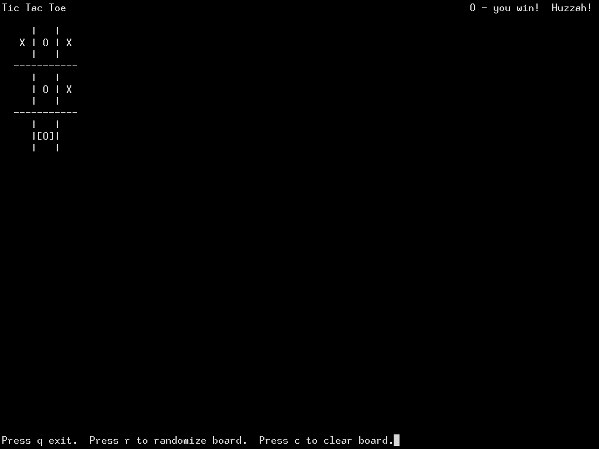

# ttt-curses



Tic tac toe and other sized mnk-game (well, M,N,N game - that is the row must
be the entire size of the board, like tic tac toe).

## Requires

- meson
- ninja
- ncurses

## Play

```bash
make run
```

## Why?

To learn ncurses and practice C project development.

## Developer notes

See [NOTES.md](./NOTES.md)

## License

LGPL.  See [LICENSE](./LICENSE)
